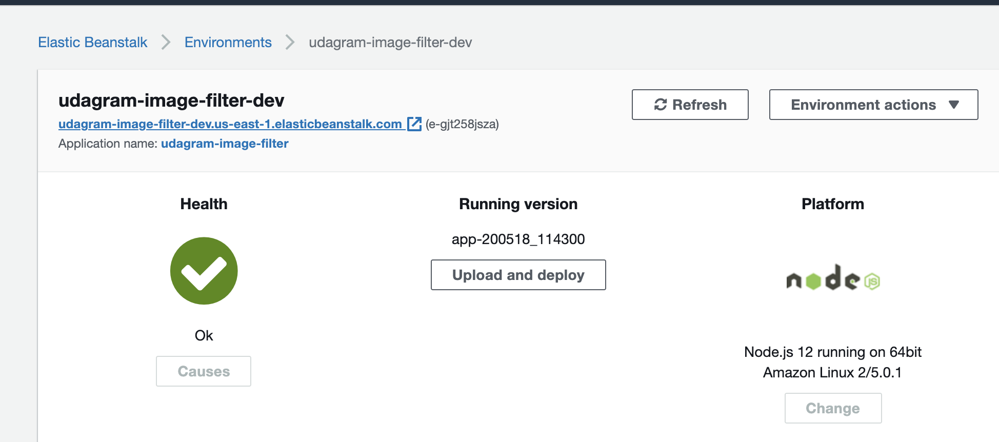

# cloud-developer
content for Udacity's cloud developer nanodegree

# udagram project submission
- 
- endpoint URL for image-filter-starter-code submission: http://udagram-image-filter-dev.us-east-1.elasticbeanstalk.com/ (also mentioned in the project's [README](course-02/project/image-filter-starter-code/README.md))

